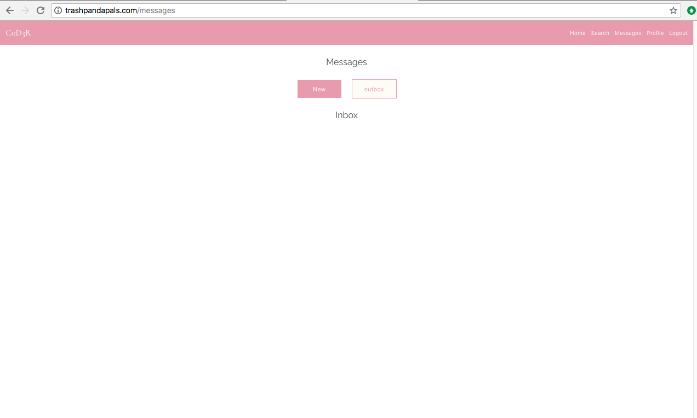

# C0D3R 

C0D3R is a web application that facilitates genuine and meaningful interactions between programmers in search of a like-minded partner. A dating app for developers, C0D3R helps coders find their missing bracket!

## Team Members

* Joshua Owens
* Lisa Dean
* Josh Brown

## Tools we used

* Javascript
* Node.js
* Amazon Web Services
* Express
* Express-handlebars
* PostgreSQL
* Bulma
* OAuth (GitHub)

## Where to find it

C0D3R is online! Check it out [here](http://www.c0d3r.joshuakowens.com/).
The git repository is located [here](https://github.com/jko113/c0d3r/). 

## Walkthrough

[](http://www.youtube.com/watch?v=xxSGhGFpLyM "C0D3R ")

### Login Page


### Home Page

After logging in via GitHub authentication and creating a profile, the user is directed to the home page. Here a handful of random users' profile cards appear on screen. It is possible to navigate to other areas of the site using links in the header.


### Profile

Users can view their own or other users' full profile. When viewing one's own profile, the option to "Edit Profile" appears.


### Search

The search feature empowers users to find other members based on their profile criteria. The versatile search can be realized with the AND keyword (a strict search) or the OR keyword (a loose search). There is also a direct search for a user by GitHub alias.


### Messages

The messages feature acts as an in-app mailbox. The user can display both sent and received messages, which are complete with timestamp and sender information. She can also compose new messages to other users by their GitHub alias.



### Logout

Ends the users current session and redirects to the login page.

## Things we're proud of

#### SQL generation for AND/OR searches and dummy data 

Search implemented by passing in a JSON object from the search form which triggers dynamic SQL generation based on a dictionary of possible statement permutations. Dummy data insert statement generated via JS program that randomly generates most fields in the users table, including date-time values.

#### Get random users feature

This method ensures the current user is not included in the result set. To obtain users randomly, it draws from the JS Math library’s random() function. It dynamically keeps track of users being displayed in order to prevent duplicates.

```javascript
function getRandomUsers(current_user_id, num_users) {

    return getAllUserIds()
        .then((arrayOfAllUserIds) => {

            let intIds = [];
            arrayOfAllUserIds.forEach((obj) => {
                intIds.push(obj.user_id);
            });
            
            if (num_users > arrayOfAllUserIds.length) {
                throw new Error('number of users specified must be <= the dataset');
            }

            let randomIds = [];
            for (let i = 0; i < num_users; i++) {
                let randomIndex = Math.floor(Math.random() * intIds.length);
                let randomValue = intIds[randomIndex];
                randomIds.push(randomValue);
                intIds.splice(randomIndex, 1);
            }
            
            let initial = 'SELECT * FROM users WHERE user_id != $1 AND user_id IN (';
            let userIds = '';
            let final = ');';

            randomIds.forEach((item, index) => {
                index === randomIds.length - 1 ? userIds += item: userIds += item + ', '; 
            });

            results = initial + userIds + final;
            return db.any(results, [current_user_id]);
        })
        .catch(console.error);
}
```

## Future Additions

#### New button to delete profile

```javascript
app.post('/delete', (req, res) => {
  db.getUserByGithubId(req.session.passport.user.id)
    .then((data) => {
      db.deleteUser(data.user_id)
        .then((deleteData) => {
          req.session.destroy();
          res.redirect('/');
        })
        .catch(console.log)
    })
    .catch(console.log)
  });
```

#### Another possible feature is deletion of user accounts and messages:

```SQL
CREATE TABLE message_recipients (
    message_id integer REFERENCES messages (message_id) ON DELETE CASCADE,
    recipient_id integer REFERENCES users (user_id) ON DELETE CASCADE,
    is_read boolean,
    PRIMARY KEY (message_id, recipient_id)
);
```

##### By adjusting this function to remove references from other tables we could implement it without making changes to the schema

```javascript
function deleteUser(id) {
    return db.result('DELETE from users WHERE user_id = $1', [id]);
}
```

#### Infinite scrolling on home page

```javascript
function scrollPage(){
    $(window).scroll(function() {
        setTimeout(scrollTimeout, 800);
    });
};

function scrollTimeout() {
  let hiddenCards = document.querySelectorAll('.hide');
  let hiddenArr = Array.from(hiddenCards);
  if ($(window).scrollTop() + $(window).height() == $(document).height()) {
    for (i=0; i<5; i++){
      if (hiddenArr[0]){
        hiddenArr[0].classList.remove('hide');
        hiddenArr = hiddenArr.slice(1, hiddenArr.length);
      } else {
        let refreshButton = document.querySelector('.refresh');
        refreshButton.classList.remove('hide');
      };
    };
  };
};
```

#### Mobile horizontal swiping on the home page

For increased usability on mobile devices, it would be helpful to incorporate a horizontal swiping feature.

#### Utilize SASS features on Bulma

The styling library we used is compatible with SASS. This would be a powerful tool to utilize in future iterations.

#### Streamline/strengthen/secure search feature

Streamlining the search feature amounts to simplifying the search experience, particularly where the UI is concerned. To the degree that strengthening the search wouldn't make it more complicated, this refers to adding more control to the user over how the search is performed. Securing the search relates to preventing database attacks.

#### Introduce message threading

Enhance message functionality by allowing users to respond directly to a message, creating a thread (or conversation).

#### Block user/Report abuse

To ensure a pleasant experience for all users of this dating app, it's important to be able to block pesky users and report abusive behavior.
