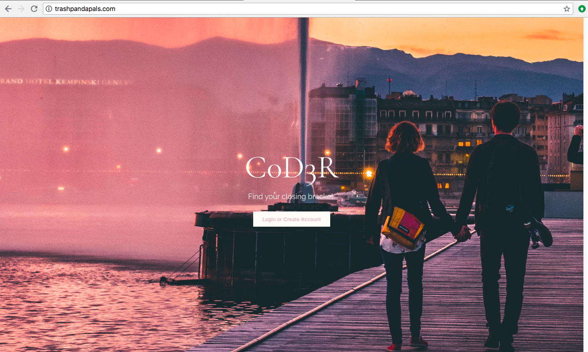
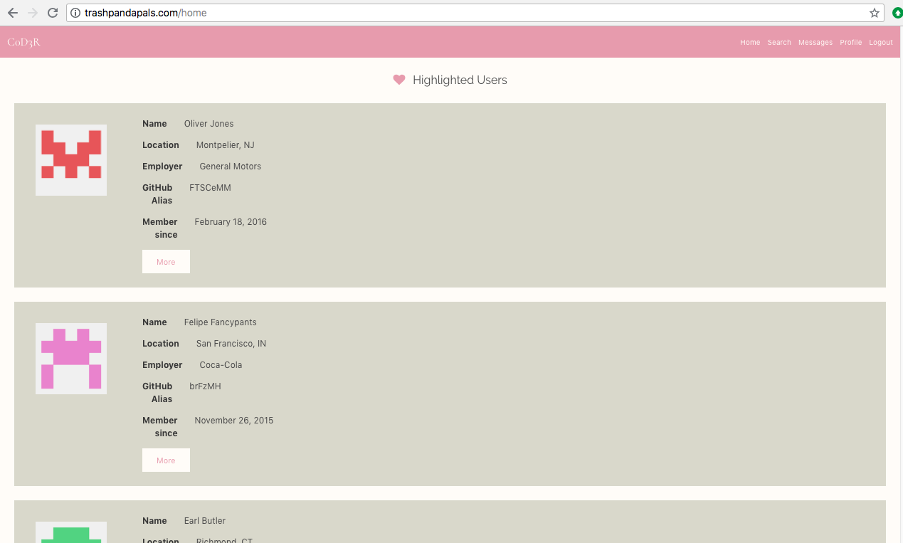
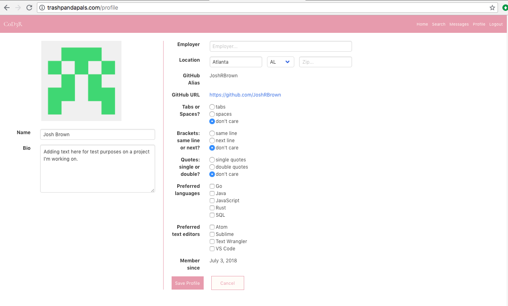
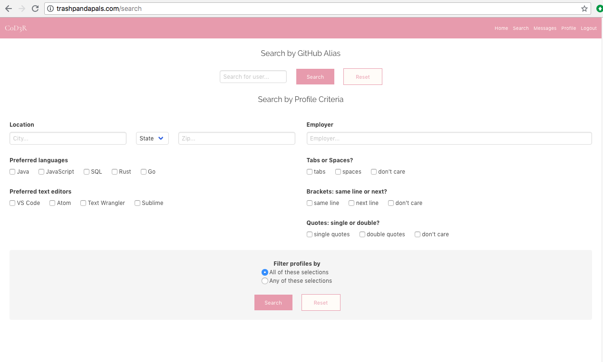

# C0d3R 

C0d3R is a resource to help facilitate coders finding other coders. Whether it is for finding people for meetups, dating, or looking for partners to collaberate on projects C0d3R is a tool be help developers find each other.

## Team Members

* Joshua Owens

* Lisa Dean

* Josh Brown

## Tools we used

* Javascript
* node.js
* Express
* Express-handlebars
* PostgreSQL
* Bulma
* OAuth (GitHub)

## Where to find it

Our project in it's entirety is hosted at http://www.trashpandapals.com to login and check it out.

Our git repository is at https://github.com/jko113/c0d3r to take a look at the code. 

## Walkthrough

### Login Page

* The first page the user sees when they visit our site

### Home Page

* After logging in the user will be taken to the home page. Here you are shown a handful of profile cards and
can navigate to other sections of the site from the header at the top of the page.

### Profile

* Here the user can view a detailed profile page. If the user is the owner of the page they will be given the option to 
edit the information on their profile or delete their account from the site altogether

### Search

* Here the user can choose from a variety of fields to narrow down the profiles their shown. The search works by or/and.  

### Messages

* This page acts as an in app mailbox. A user can get display their message or compose a new message to another user by their GitHub alias.

### Logout

* This will end the users current session in the app and return to the login page.

## Challenges

## Lessons Learned

## Future Additions
